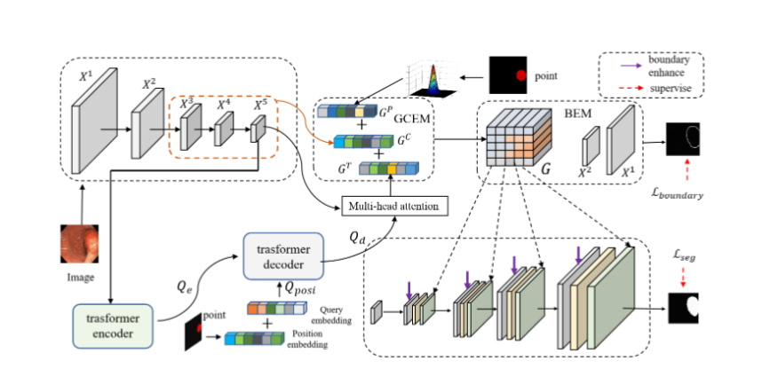
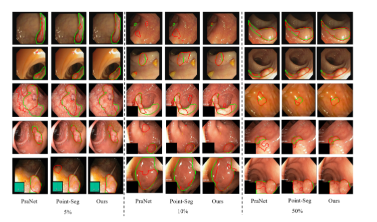
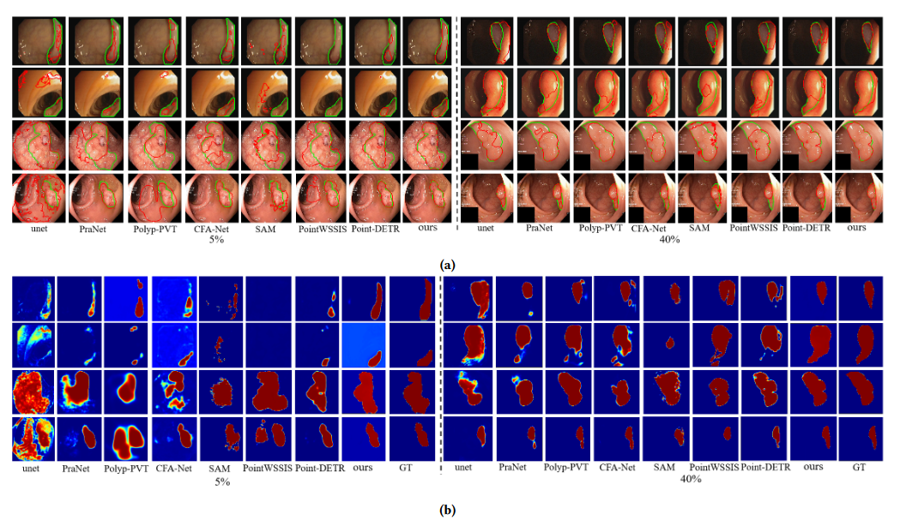

#  Joint Edge-aware and Global context for polyp segmentation with cross-layer mapping


##  Requirements

* torch
* torchvision 
* tqdm
* opencv
* scipy
* skimage
* PIL
* numpy
### 1. Framework Overview

<p align="center">
     <br />
    <em> 
    Figure 1: Overview of the proposed PWSNet.
    </em>
</p>

### 2. Training teacher model

```bash
python main.py --trainper '20per'  
```

###  3. Inference pseudo-labels

```bash
python test.py  --trainper '20per'

```

###  4. Use pseudo-labels Training student model
###  5. result
<p align="center">
     <br />
    <em> 
    Figure 2: contour vison of pseudo-label.
    </em>
</p>
<p align="center">
     <br />
    <em> 
    Figure 3: heat-map vison of pseudo-label.
    </em>
</p>

