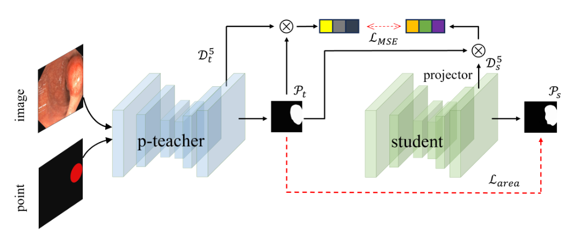

#  WS-Polyp: Improved Weak Semi-supervised with point teacher for polyp segmentation


##  Requirements

* torch
* torchvision 
* tqdm
* opencv
* scipy
* skimage
* PIL
* numpy

### 1. Recent Methods
<p align="center">
     <br />
    <em> 
    Figure 1: labeled image $\mathcal{I}_l$, point prompt $\mathcal{P}$, unlabeled image $\mathcal{I}_{unl}$. $\mathcal{M}_{unl}$, $\mathcal{M}_l$ represent the masks inferred from unlabeled and labeled images, respectively. The red arrows in the figure represent supervision.
    </em>
</p>

### 2. Framework Overview

<p align="center">
     <br />
    <em> 
    Figure 2: Our proposed point-prompt teacher model (p-teacher).
    </em>
</p>
<p align="center">
     <br />
    <em> 
    Figure 3: a) Deep Feature Extraction Module (DFEM). (b) The image size is $320\times320$ with point coordinates (160, 160) encoded as a Gaussian kernel with $\sigma$ of 20.
Module (BEM).
    </em>
</p>
<p align="center">
     <br />
    <em> 
    Figure 4: Intermediate Feature Knowledge Distillation (IFKD).
    </em>
</p>

### 3. Training

###step1. Training teacher
```bash
python main.py  --train_per '50per'

```
###step1. Training student via IFKD
```bash
python train_stu.py  --train_per '50per'

```


###  4. Inference

```bash
python test.py  --mode test  --load_ckpt checkpoint 
```
###  5. result
<p align="center">
     <br />
    <em> 
    Figure 5: Teacher for generating masks performance in the Kvasir and the CVC-ClinicDB dataset.
    </em>
</p>
<p align="center">
     <br />
    <em> 
    Figure 6: Box plots of dice similarity coefficient. For more results please refer to the supplementary material.
    </em>
</p>
<p align="center">
     <br />
    <em> 
    Figure 7: The student Dice performance across different teachers and different training iterations.
    </em>
</p>
<p align="center">
     <br />
    <em> 
    Figure 8: (a) The green contour represents the boundary of the GT, while the red denotes the prediction. (b) The predicted heatmap.
    </em>
</p>
<p align="center">
     <br />
    <em> 
    Figure 9: (a) Visual results of disassembly of key components of the p-teacher model. (b) The impact of MCEM on boundary extraction by DBEM.
    </em>
</p>

